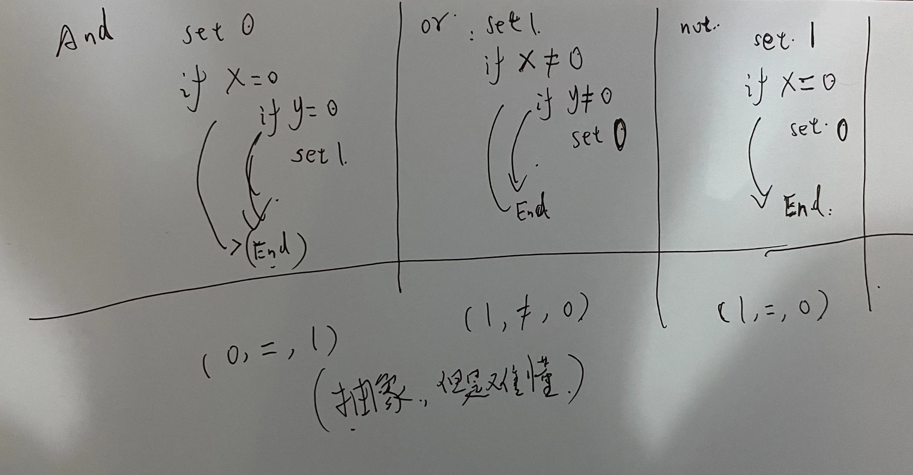

## 项目7 VM Translator 说明

### 运行
    python vm_translator.py XXX.vm

### 程序结构

    主程序:vm_translator.py
        解析vm命令：parsing.py
        生成汇编：coding.py
    
    ST: symbol_table.py
    辅助代码: util.py

备注：coding_logic_op.py是我认为正确的实现逻辑，下面将具体分析。

### logic_ops （and or not）

    
    and or not 三个op通过if-jump实现的代码逻辑（如上图所示）
        A) 通常的理解是return True or False
        B) 测试中的逻辑是bit-wise and|or|not    
        比如: 
            A) 按照我的理解
                (010 and 101) = True & True = True
            B) 按照测试代码的理解
                (010 and 101) = 000  = 结果为False
        A、B两种实现就出现了歧义
        
    
### eq  lg  lt 布尔运算
    测试中 True 要表示为 1111 1111 1111 1111
                 而不是 0000 0000 0000 0001