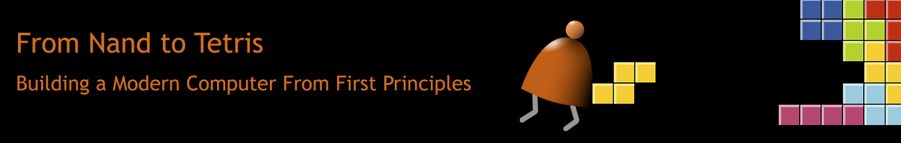

# From Nand to Tetris

## 1、简介
    Building a Modern Computer From First Principles.
    This is the course project from Coursera.
        * P1：nand => gate => ALU => memory => cpu => assembler
        * P2：assembler => VM => complier => os

## 2、进度
* P1 [HARDWARE](https://link.zhihu.com/?target=https%3A//www.coursera.org/learn/build-a-computer)
  * [X]  Project 1: Boolean Logic ([link](https://www.nand2tetris.org/project01))
  * [X]  Project 2: Boolean Arithmetic ([link](https://www.nand2tetris.org/project02))
  * [X]  Project 3: Memory ([link](https://www.nand2tetris.org/project03))
  * [X]  Project 4: Machine Language Programming ([link](https://www.nand2tetris.org/project04))
  * [X]  Project 5: Computer Architecture ([link](https://www.nand2tetris.org/project05))
  * [X]  Project 6: The Assembler ([link](https://www.nand2tetris.org/project06)) [[assembler]](./06%20The%20Assembler/assembler.py)

* P2 [SOFTWARE](https://www.coursera.org/learn/nand2tetris2)
  * [X]  Project 7: Virtual Machine I - Stack Arithmetic ([link](https://www.nand2tetris.org/project07)) [[README]](./07%20Virtual%20Machine%20I/README.md) [[vm_translator]](./07%20Virtual%20Machine%20I/vm_translator.py)
  * [X]  Project 8: Virtual Machine II - Program Control ([link](https://www.nand2tetris.org/project08)) [[README]](./08%20Virtual%20Machine%20II/README.md) [[vm_translator]](./08%20Virtual%20Machine%20II/vm_translator.py)
  * [ ]  Project 9: High-Level Programming ([link](https://www.nand2tetris.org/project09))
  * [X]  Project 10: Compiler I - Syntax Analysis ([link](https://www.nand2tetris.org/project10)) [[README]](./10%20Compiler%20I/README.md) [[compiler]](./10%20Compiler%20I/compiler.py)
  * [X]  Project 11: Compiler II - Code Generation ([link](https://www.nand2tetris.org/project11)) [[README]](./11%20Compiler%20II/README.md) [[compiler]](./11%20Compiler%20II/compiler.py)
  * [ ]  Project 12: The Operating System ([link](https://www.nand2tetris.org/project12))